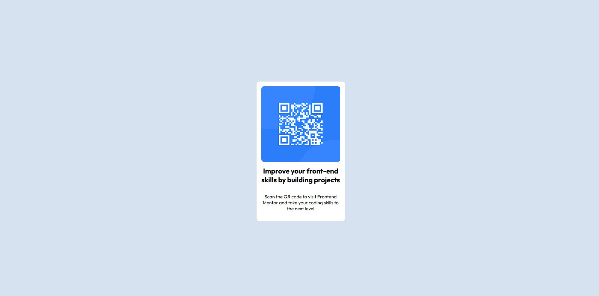

# Frontend Mentor - QR Code Component Solution

This is my solution to the [QR code component challenge](https://www.frontendmentor.io/challenges/qr-code-component-iux_sIO_H) from Frontend Mentor.

I built this project while learning HTML and CSS through The Odin Project and used it to get more hands-on practice with layout and responsive design.

## Overview

### Screenshot

### Links

- Solution URL: https://github.com/khattakahmad18/qr-code-component
- Live Site URL:https://khattakahmad18.github.io/qr-code-component

## My Process

### Built With

- HTML5
- CSS3
- Flexbox
- Responsive design

### What I Learned

This project helped me practice:

- Structuring a page with HTML
- Styling elements with CSS
- Using Flexbox to center and arrange elements
- Working with spacing, padding and margins
- Using custom fonts
- Making a layout work at different screen sizes
- Comparing my result with a provided design

### Continued Development

I'm still building my HTML and CSS fundamentals, so I want to continue improving:

- Responsive design
- CSS layout
- Flexbox
- Writing cleaner CSS
- Building projects without relying on copied solutions

My next focus is JavaScript so I can start adding interactivity to my projects.

### Useful Resources

- [Frontend Mentor](https://www.frontendmentor.io/) - Used the challenge and design as the reference for this project.
- [The Odin Project](https://www.theodinproject.com/) - Used for learning HTML, CSS and web development fundamentals.

### AI Collaboration

I used ChatGPT as a learning and debugging assistant during this project.

I mainly used AI to:

- Understand CSS and Flexbox concepts
- Get hints when I was stuck
- Check whether my approach was correct
- Understand responsive design
- Review parts of my work

I wrote the HTML and CSS myself rather than using AI to generate the complete solution.

## Author

- GitHub - [@khattakahmad18](https://github.com/khattakahmad18)
- Frontend Mentor - Add your Frontend Mentor profile URL here

## Acknowledgments

Thanks to Frontend Mentor for providing the challenge and design.